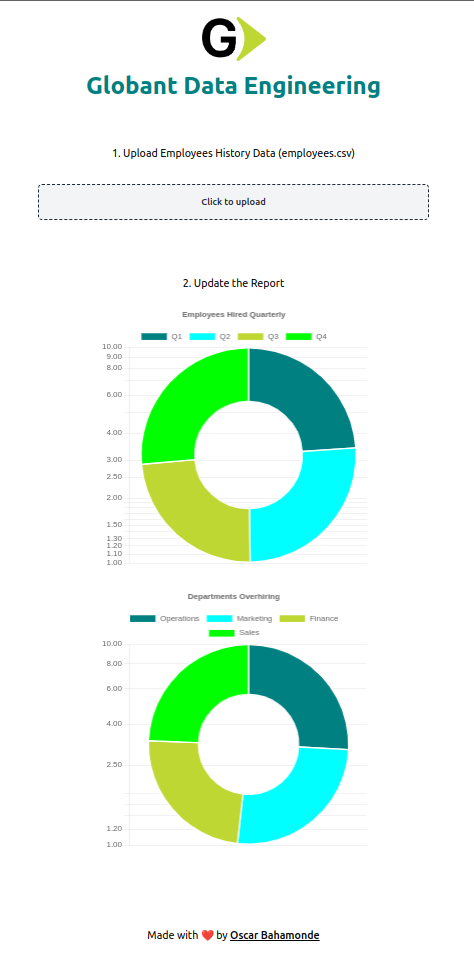

# Globant Code Challenge

## Tech Stack Chosen

- TypeScript - Programming Language (Frontend)
- Python - Programming Language (Backend)
- Vue.js - Frontend Framework
- FastAPI - Backend Framework
- Pydantic - Data Validation
- Prisma - ORM
- PostgreSQL - SQL Database
- Github - Version Control
- Docker - Build System
- AWS EC2 - Deployment Environment
- Uvicorn - ASGI Server
- NGINX - Reverse Proxy
- Cloudflare - DNS Management and CDN

Live [Here](https://globant.aiofauna.com/docs)

